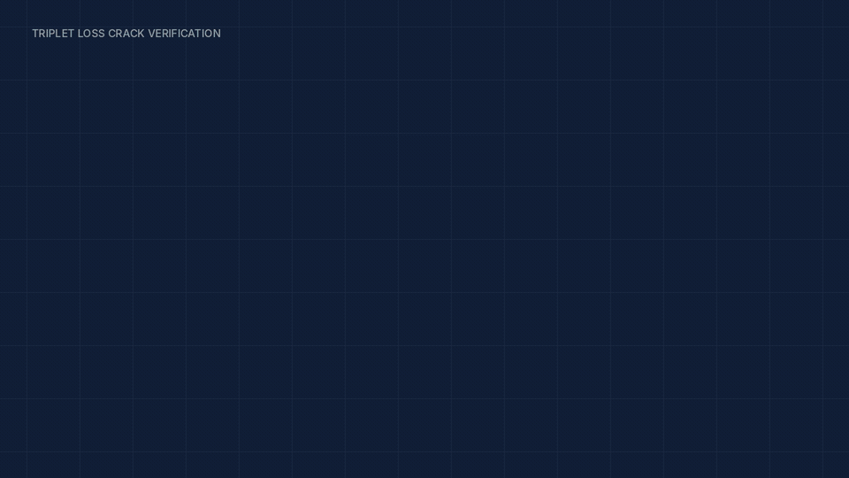
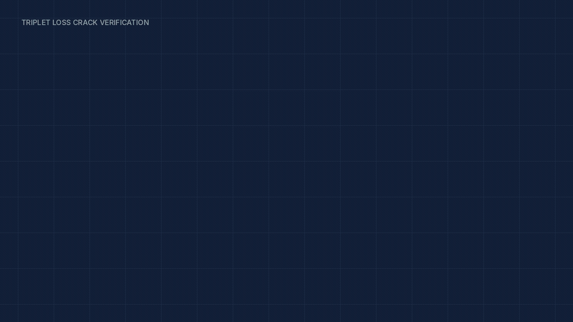
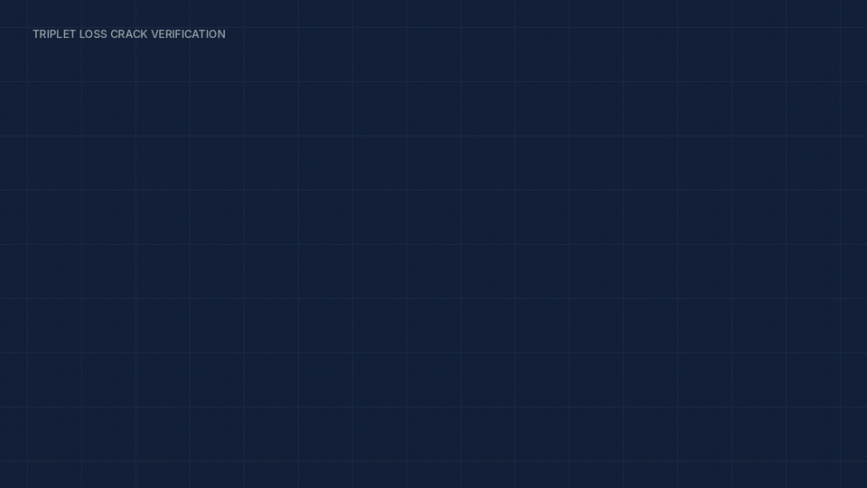
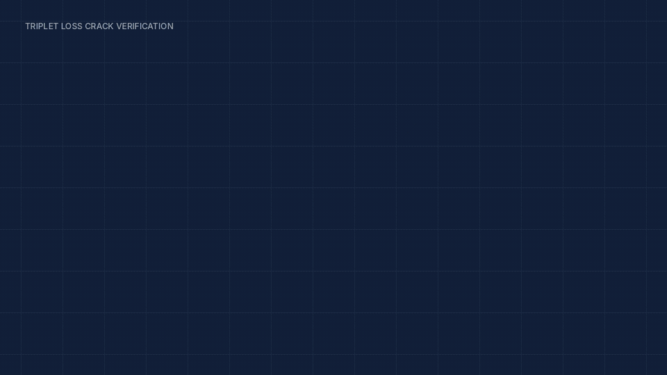
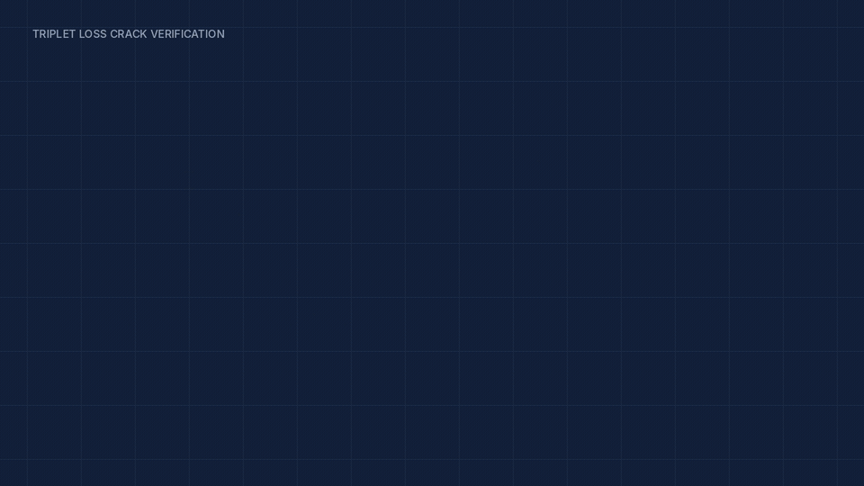
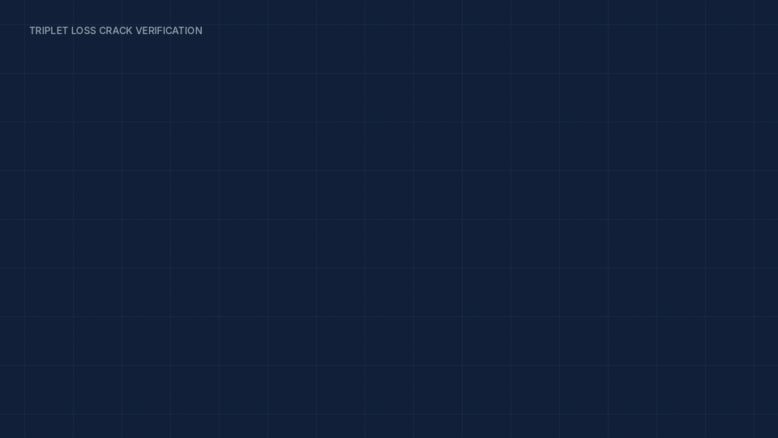
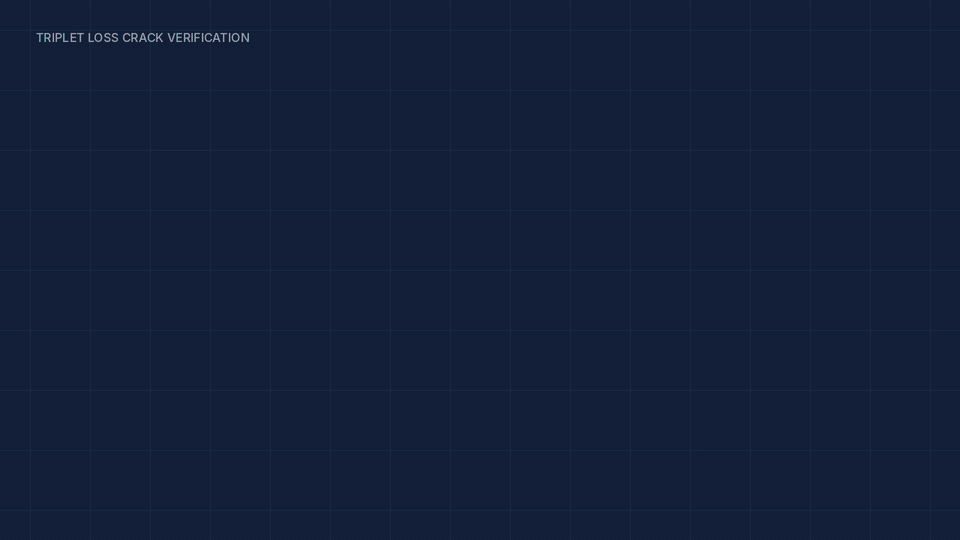
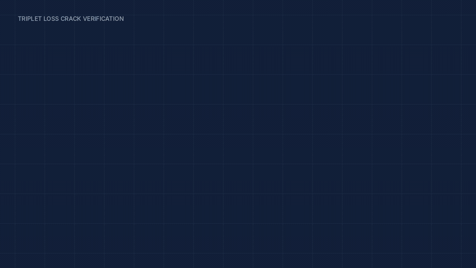
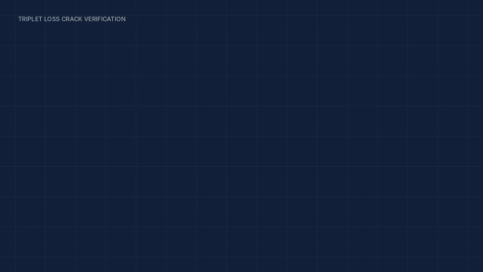
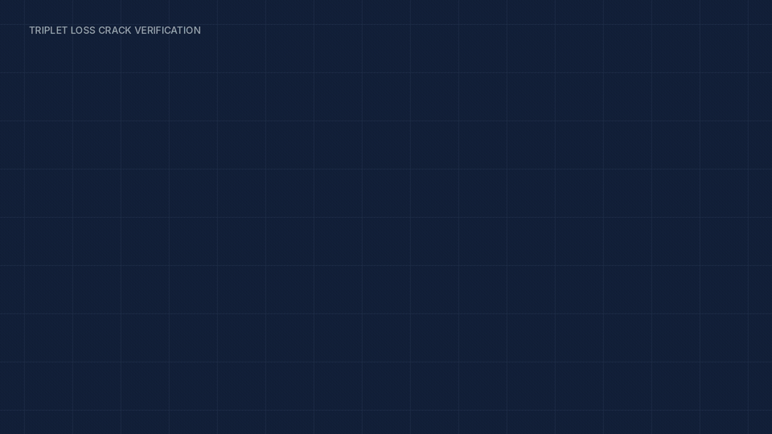

# Triplet Loss-Based Concrete Crack Verification

An embedding-based approach for deciding whether two concrete-crack images represent the same crack pattern, using a shared ResNet-101 encoder and triplet loss.

<p align="center">
  
</p>

## Overview

Conventional crack detection asks whether a crack is present. This work addresses a different question: **is the crack observed now the same crack that was observed before?**

That distinction matters in Structural Health Monitoring (SHM). A detector can flag damage in an image, but it does not by itself establish the identity of that damage across observations. The proposed system maps crack images into an embedding space and uses embedding distance for verification.

## Method at a Glance

```text
Anchor + Positive + Negative
             |
             v
     shared ResNet-101 encoder
             |
             v
       128-dimensional embeddings
             |
             v
        Triplet loss and distances
             |
             v
   similar patterns closer, different patterns farther apart
```

The training triplet contains an anchor image, a positive image with a similar crack pattern, and a negative image with a different pattern. The shared encoder is applied to all three images. During inference, two images are encoded and compared using their embedding distance.

## Visual Walkthrough

### 1. The verification problem





Two observations can differ because of viewpoint, orientation, illumination, or crack appearance. The target is to determine whether they correspond to the same crack pattern.

### 2. Triplet-based training





The anchor is the reference image. The positive is produced from the same anchor in the training setup described in the paper, using image transformations such as rotation and shearing. The negative is a different crack image. These transformed positives are not real repeated observations of a crack over time.

### 3. Learning the embedding space





The network learns a representation where similar crack patterns have smaller embedding distances and dissimilar patterns are separated. The triplet loss is

```text
L = max(0, d(a, p) - d(a, n) + margin)
```

It penalizes cases where the negative is not farther from the anchor than the positive by at least the chosen margin.

### 4. Verification and monitoring concept








After training, images are encoded and compared using embedding distance. The monitoring and digital-twin scenes illustrate a possible downstream use of crack identity tracking; they are conceptual and do not represent additional longitudinal experiments reported in the paper.

## Network Architecture

The model is a Siamese network with a shared ResNet-101 feature extractor. The paper describes a pre-trained ResNet-101 backbone followed by dense layers of 256 and 128 units, each with ReLU and batch normalization, and a final 128-dimensional embedding output. Triplet loss is used to train the shared encoder by comparing anchor-positive and anchor-negative distances.

## Dataset and Training

The paper uses the 20,000-image Crack Dataset and prepares it as triplets. It reports 12,000 images for training, 3,000 for validation, and 5,000 for testing. Positive examples are generated through transformations of anchor images, including rotation and shearing.

The reported configuration is:

| Setting | Value |
| --- | --- |
| Input size | 227 × 227 pixels |
| Batch size | 32 |
| Epochs | 200 |
| Optimizer | Adam |
| Learning rate | 1e-4 |
| Epsilon | 1e-1 |
| Triplet-loss margin | 1 |
| Dense layers | 256, then 128 units; ReLU + batch normalization |
| Embedding size | 128 |

The local working copy is under [`data/triplet_crack_dataset`](data/triplet_crack_dataset). The original training and evaluation notebooks are kept under [`research/`](research/), while the saved embedding model and distance records are under [`artifacts/`](artifacts/).

## Results

The paper reports the following image-verification metrics on its evaluation:

| Metric | Reported value |
| --- | ---: |
| Accuracy | 97.36% |
| Precision | 95.77% |
| Recall | 99.1% |
| F1 score | 97.41% |
| AUC | 99.61% |

The paper reports mean Manhattan distances of 5.13 (standard deviation 2.01) for positive pairs and 19.89 (standard deviation 5.75) for negative pairs. The reported optimal embedding-distance threshold is 10.56.

These results evaluate image verification on the prepared triplet data. They do not validate deployment in a live SHM system, real-time operation, UAV capture, or a complete Digital Twin implementation.

## Why This Matters for Structural Health Monitoring

Crack detection answers whether damage is visible in one image. Crack verification adds an identity question: whether a later observation corresponds to the same physical damage. If that identity can be established reliably, future monitoring workflows could compare the crack's appearance over time instead of treating every detection as an unrelated event.

The paper presents this as a direction for structural monitoring and digital-twin applications. The repository does not claim that longitudinal crack-evolution tracking was experimentally validated.

## Limitations

The paper identifies a central limitation: positive training images were generated by transforming anchor images rather than by collecting real repeated observations of the same crack. Real longitudinal observations would be an important next step for testing whether the learned representation transfers to changing field conditions and for assessing generalization beyond synthetic positive pairs.

## Motion Graphic

The motion graphic is an explanatory visualization of the paper's methodology. The canonical scene GIFs are retained in `assets/motion/`; the renderer rebuilds the composite timeline from those scenes.

```bash
python src/generate_motion_graphic.py
```

The default output is `assets/motion/full_methodology.gif`. Optional MP4 export is available with `--format mp4` and requires FFmpeg as a system dependency:

```bash
python src/generate_motion_graphic.py --format mp4 --output render/methodology.mp4
```

Install the Python dependency with:

```bash
python -m pip install -r requirements.txt
```

## Citation

```bibtex
@inproceedings{neyestani2024triplet,
  author    = {Neyestani, Arman and Picariello, Francesco and Tudosa, Ioan and Daponte, Pasquale and De Vito, Luca},
  title     = {Triplet Loss-Based Concrete Crack Verification for Structural Health Monitoring and Digital Twin Applications},
  booktitle = {2024 IEEE International Conference on Metrology for eXtended Reality, Artificial Intelligence and Neural Engineering (MetroXRAINE)},
  year      = {2024},
  pages     = {837--842},
  doi       = {10.1109/MetroXRAINE62247.2024.10797100}
}
```

The source paper is available at [`paper/triplet_loss_crack_verification.pdf`](paper/triplet_loss_crack_verification.pdf).

## Authors and Acknowledgment

Arman Neyestani, Francesco Picariello, Ioan Tudosa, Pasquale Daponte, and Luca De Vito, Department of Engineering, University of Sannio.

The paper acknowledges partial support from the NATO Science for Peace and Security Programme Multi-Year Project G5924, “Inspection and security by Robots interacting with Infrastructure digital twins” (IRIS).

The repository code is released under the MIT License. The paper and third-party dataset content retain their original rights and terms; see [`LICENSE`](LICENSE) for the repository-code license.
